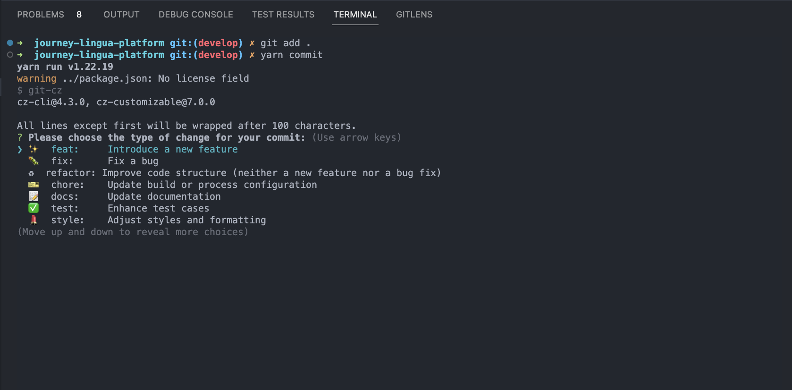

# Using Commitizen

## Making Commits

1. To create a commit, instead of using git commit -m "Your commit message", use the following command:

```bash
yarn commit
```

2. Commitizen will then prompt you to fill in information about your commit, including:

-   type: 'Please choose the type of change for your commit:',
-   customScope: '\nSpecify the scope of this change (optional):',
-   subject: 'Briefly describe your changes:\n',
-   body: 'Provide a detailed description of your changes (optional). Use "|" for line breaks:\n',
-   breaking: 'List any BREAKING CHANGES (optional):\n',
-   footer: 'List any issues closed by this change (optional). For example: #31, #34:\n',
-   confirmCommit: 'Are you sure you want to commit these changes?',



3. Fill in the required information following the prompts.

4. Commitizen will generate a commit message based on the provided information and automatically add the commit to your Git history.
