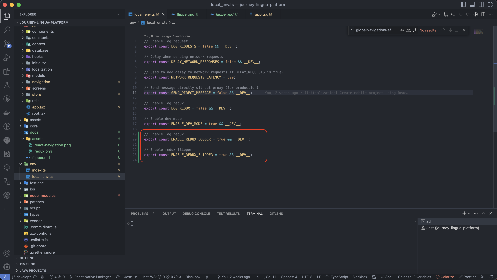
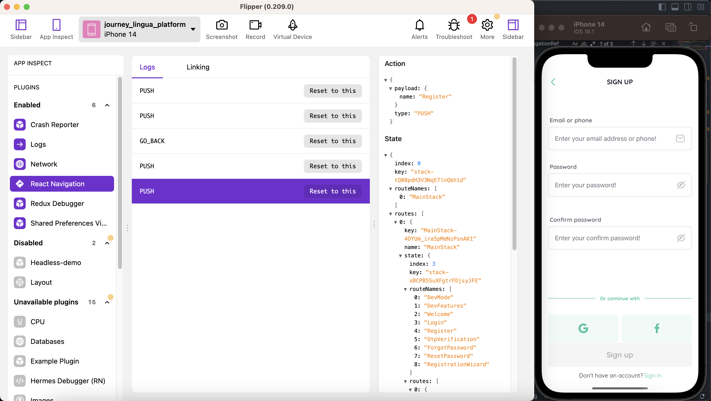
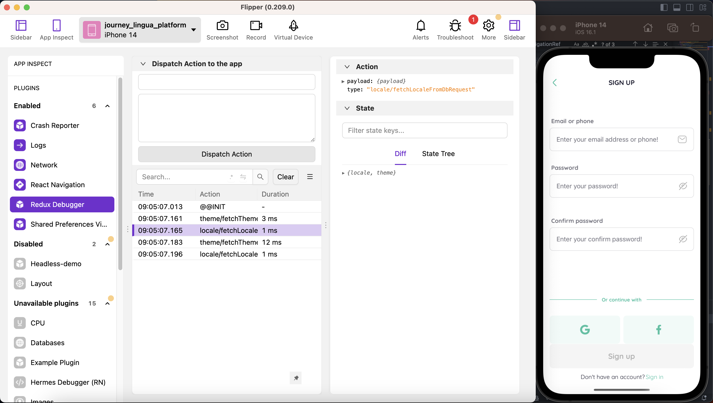

# Setting up Flipper for React Native

## Introduction

Flipper is a platform for debugging mobile apps, developed by Facebook. It provides a convenient way to inspect and debug React Native apps on both iOS and Android platforms. This document will guide you through the process of setting up Flipper for your React Native project.

## Prerequisites

Before getting started, make sure you have the following installed on your development machine:

-   Node.js and npm (Node Package Manager)
-   React Native CLI
-   Xcode (for iOS development on macOS)
-   Android Studio (for Android development)

## Installation

### Step 1: Install Flipper Desktop Client

Download and install the Flipper desktop client from the official website: [https://fbflipper.com](https://fbflipper.com)

### Step 2: Enable Flipper Debugger for app

## Usage

Now that you have Flipper set up for your React Native project, you can connect your app to the Flipper desktop client by following these steps:

1. Launch the Flipper desktop client on your computer.
2. Run your React Native app on a simulator or real device.
3. The device will automatically connect to Flipper desktop.

You should now be able to inspect your app, view logs, and use various Flipper plugins to debug your React Native application.

## React Navigation Usage

## React Redux Usage

## Conclusion

Congratulations! You have successfully set up Flipper for your React Native project. With Flipper's powerful debugging capabilities, you can now streamline the debugging process and improve your app's overall development experience. Happy coding!
