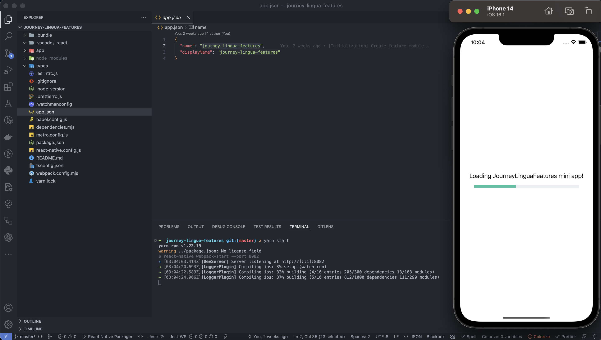

# Super App Journey Lingua Platform

Welcome to the Journey Lingua Super App development platform, where you can create and run mini apps using React Native and Re.Pack. This document will guide you on how to set up and run mini apps within the Super App environment.

## How to use

Before you can start developing mini apps, you need to set up the environment and install the necessary dependencies. Follow the steps below to get started:

### Setup supper-app

1. Clone the Journey Lingua Super App <https://github.com/loyal-ki/jl-platform> to your local machine.
2. Open a terminal or command prompt and navigate to the root directory of the Journey Lingua repository.
3. Install the dependencies for all apps by running the following command:

```typescript
    yarn all
```

4. Run supper app:

```typescript
    yarn run ios
```

5. To start the development server for the supper app, run the following command:

```typescript
    yarn start
```

This command will initiate the development server and make your mini apps accessible.

### Setup mini-app

1. Clone the Journey Lingua Super App <https://github.com/loyal-ki/jl-platform> to your local machine.
2. Open a terminal or command prompt and navigate to the root directory of the Journey Lingua repository.
3. Install the dependencies for all apps by running the following command:

```typescript
    yarn all
```

4. To start the development server for the mini app, run the following command:

```typescript
    yarn start
```



## Conclusion

Congratulations! You have now learned how to set up and run mini apps within the Journey Lingua Super App environment using React Native and Re.Pack. You can create various mini apps to extend the functionality of the Super App and enhance the user experience.
